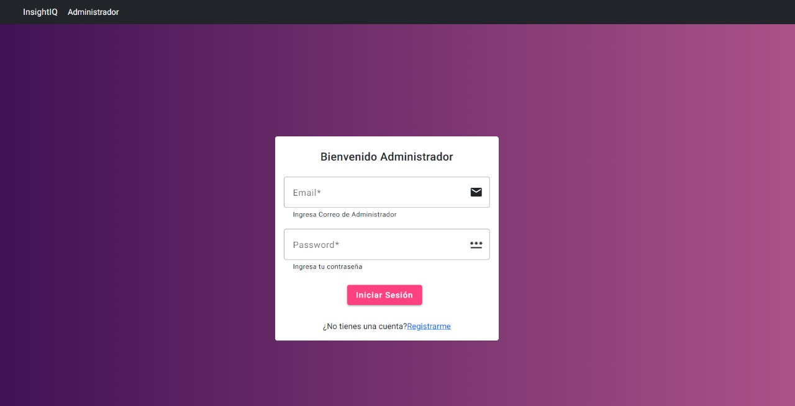

<h1 align="center"><b>Hi, I'm Juan Carlos Medina</b></h1>

<!-- Typing SVG -->

    

    

        
    

<!-- Introduction -->

    You have discovered my GitHub profile.  
    Please feel free to clone/fork projects, raise issues, and submit PRs if you think something could be better.  

<!-- GitHub Stats and Experience -->

    <h3>My GitHub Stats</h3>
    

      
      
    

  
## <b> Skills</b>

 

- **Languages**:
    

    
    
- **Front-End Development**:

 

- **Proyectos trabajados**:

<table>
<tr>
<td width="50%">
<h3 align="center">Participación de proyecto AppJoven</h3>

Realización de pantallas para lineas de ayuda en la aplicación AppJoven Saltillo para dispositivos móviles. Desarrollada en flutter.

                                                                                  
</td>
<td width="50%">
<h3 align="center">Aplicación personal de negocio de comida</h3>

Elaboración de proyecto con gráficas que muestran ganancia semanal de venta de negocio. Además se puede ingresar ordenes y pedidos así como costes de inventario para el calculo automatico de las ganancias. Desarrollada en flutter.

                                                                                  
</td>
<td width="50%">
<h3 align="center">Desarrollo de Aplicación web Angular Loggin con autenticación</h3>

 Loggin con autenticación de página realizada para tests de personalidad. Back End y Front End 

                                                                                  
</td>

